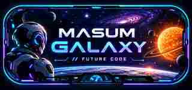

# Masum Galaxy // Future Code

<p align="center">
  
</p>

**Futuristic robotic coding. Galaxy atmosphere. Code stays in focus.**

**Marketplace** · **Free** · **MIT** · **Optional Animated Cockpit**

A futuristic robotic dark theme for Visual Studio Code by **Masum Billah**. The core extension is a normal VS Code color theme. The optional **Galaxy Cockpit** adds an animated solar-system background, HUD effects, glass panels, neon glow and a 40-second planet cycle.

> **Marketplace:** [Install Masum Galaxy // Future Code](https://marketplace.visualstudio.com/items?itemName=gitwithmasum.masum-galaxy-future-code)

## Galaxy Cockpit

The visual system follows one rule: **the galaxy should look cinematic without fighting the code**. Background effects are dimmed, softened and kept behind a high-contrast robotic syntax palette.

### Highlights

- **Robotic neon syntax** — cyan, violet, blue and controlled accent colors tuned for dark environments.
- **8-planet animated loop** — Mercury, Venus, Earth, Mars, Jupiter, Saturn, Uranus and Neptune.
- **5-second planet scenes** — the complete cycle lasts about 40 seconds.
- **Solar ambience** — Sun, Moon, stars, nebula drift, orbit lines and HUD scan effects.
- **Glass cockpit UI** — futuristic sidebar, panel, active-line and cursor treatments.
- **Readable by design** — dark overlays keep code visually dominant during long sessions.
- **Optional animation** — remove the cockpit at any time without uninstalling the color theme.
- **Subtle signature** — `MASUM BILLAH // GALAXY CORE` stays nearly invisible while coding.

## Quick install

1. Open **Extensions** with `Ctrl+Shift+X`.
2. Search for **Masum Galaxy // Future Code**.
3. Click **Install**.
4. Open the Command Palette with `Ctrl+Shift+P`.
5. Run **Preferences: Color Theme**.
6. Select **Masum Galaxy // Future Code**.

The normal theme works immediately through the standard VS Code theme API.

## Enable the animated Galaxy Cockpit

The animated background is optional because VS Code's official theme API does not support arbitrary animated workbench backgrounds.

1. Open the Command Palette.
2. Run **Masum Galaxy: Install Animated Cockpit**.
3. If **Custom CSS and JS Loader** is not installed, Masum Galaxy will offer to install it.
4. Choose **Reload Custom CSS/JS** when prompted.
5. Restart VS Code if requested.

### Cockpit commands

```text
Masum Galaxy: Install Animated Cockpit
Masum Galaxy: Reload Animated Cockpit
Masum Galaxy: Remove Animated Cockpit
```

## Important note about the animated layer

The optional cockpit uses `be5invis.vscode-custom-css`, which modifies VS Code workbench files outside the official extension styling API. VS Code may therefore show a modified/corrupt-installation warning, and after a VS Code update the cockpit may need to be reloaded.

The **normal Masum Galaxy color theme is unaffected** and can be used without the custom cockpit layer.

On Windows, the Custom CSS and JS Loader may require VS Code to run with Administrator permission while applying or removing the workbench modification.

## Focus and performance

The cockpit is intentionally dimmed so code stays dominant. If you prefer maximum focus, lower GPU usage or a completely standard VS Code workbench, run:

```text
Masum Galaxy: Remove Animated Cockpit
```

The color theme remains installed and active.

## Local development

```bash
npm install
npm run package
```

On Windows PowerShell systems that block `npm.ps1`, use:

```powershell
npm.cmd install
npx.cmd vsce package
```

The command produces a `.vsix` package that can be installed through **Extensions → ... → Install from VSIX...**.

## Support

For visual bugs, installation problems or feature requests, use the [GitHub issue tracker](https://github.com/gitwithmasum/Galaxy-VS-Code-Themes/issues). See [SUPPORT.md](SUPPORT.md) for the information that helps diagnose rendering problems quickly.

## Links

- [VS Code Marketplace](https://marketplace.visualstudio.com/items?itemName=gitwithmasum.masum-galaxy-future-code)
- [GitHub Repository](https://github.com/gitwithmasum/Galaxy-VS-Code-Themes)
- [Issue Tracker](https://github.com/gitwithmasum/Galaxy-VS-Code-Themes/issues)

## License

MIT License.

## Author

**Masum Billah** — [gitwithmasum](https://github.com/gitwithmasum)
