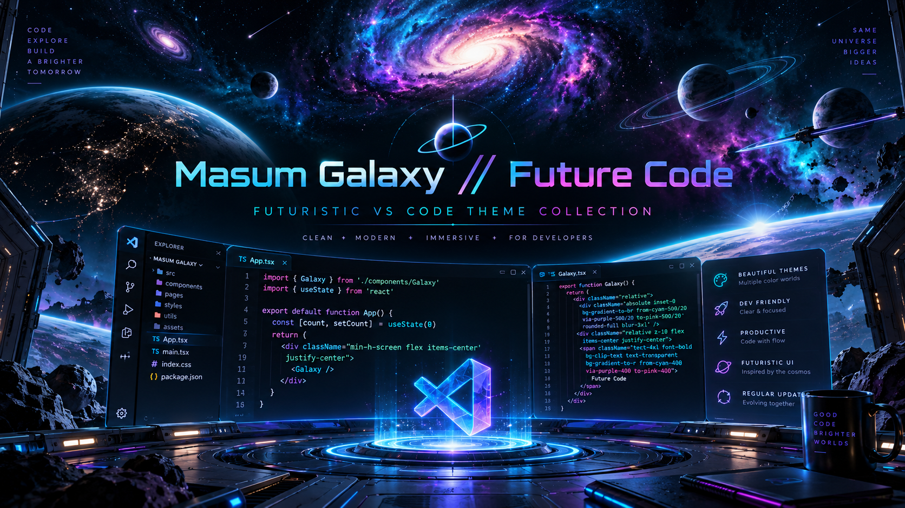

# Masum Galaxy // Future Code

<p align="center">
  
</p>

**11 futuristic VS Code themes. One extension. One Theme Selector. Optional animated cinematic workbench modes.**

**Marketplace** · **Free** · **MIT** · **Dark Themes** · **Optional Animated Modes**

**Masum Galaxy // Future Code** is a futuristic VS Code theme collection by **Masum Billah**. It combines readable developer-focused syntax palettes with optional animated workbench scenes inspired by space, AI, cyberpunk, Mars, deep ocean, aurora skies, mecha systems and solar energy.

> **Marketplace:** [Install Masum Galaxy // Future Code](https://marketplace.visualstudio.com/items?itemName=gitwithmasum.masum-galaxy-future-code)


## Theme Preview

<p align="center">
  
</p>

The core **Masum Galaxy // Future Code** palette is built around a deep-space editor surface with **cyan keywords**, **purple functions**, **green strings**, **gold numbers**, **pink types/classes** and cool-white foreground text.

### HTML

```html
<!DOCTYPE html>
<html lang="en">
  <head>
    <title>Galaxy Portfolio</title>
  </head>
  <body class="galaxy-app">
    <h1>Build the Future</h1>
  </body>
</html>
```

### CSS

```css
:root {
  --bg: #030510;
  --accent: #00f7ff;
}

.galaxy-card {
  background: rgba(5, 8, 23, 0.88);
  border: 1px solid var(--accent);
  box-shadow: 0 0 28px #00f7ff55;
}
```

### JavaScript

```javascript
const themes = ["Galaxy", "AI Core", "Cyber City"];

function activateTheme(name) {
  const active = themes.includes(name);
  return active ? `Loading ${name}` : "Unknown";
}

activateTheme("Galaxy");
```

### Python

```python
from dataclasses import dataclass

@dataclass
class Theme:
    name: str
    animated: bool = True

def launch(theme: Theme) -> str:
    return f"{theme.name} ready"

print(launch(Theme("Galaxy")))
```

> Preview note: syntax colors vary slightly by language grammar and VS Code tokenization, while the theme keeps the same Galaxy visual identity.

## 11 included themes

| # | Theme | Visual direction |
|---|---|---|
| 1 | **Masum Galaxy // Future Code** | Solar-system cockpit, planets, stars, nebula and HUD |
| 2 | **Masum Cyber City // Neon Rain** | Neon megacity, rain, holograms and cyberpunk traffic |
| 3 | **Masum AI Core // Neural Engine** | Neural rings, AI nodes, data pulses and scanner grid |
| 4 | **Masum Black Hole // Event Horizon** | Black hole, accretion disk, lens arcs and comet trails |
| 5 | **Masum Quantum Grid // Q-Core** | Quantum lattice, glowing nodes and phase pulses |
| 6 | **Masum Mars Colony // Red Frontier** | Mars base, rover, drone, domes and red frontier landscape |
| 7 | **Masum Deep Ocean // Abyss Core** | Bioluminescent abyss, jellyfish, bubbles and deep-sea drone |
| 8 | **Masum Aurora // Polar Light** | Northern lights, polar beams, moon, snow and icy mountains |
| 9 | **Masum Mecha Core // Titan Reactor** | Titan reactor, mechanical rings, sparks and industrial HUD |
| 10 | **Masum Orbital Station // Nexus One** | Earth orbit, space station, satellites and spacecraft traffic |
| 11 | **Masum Solar Flare // Helios Core** | Sun, corona rings, solar-flare arcs and plasma particles |

Every theme is designed around a dark coding surface with clear syntax contrast, visible text selection and practical readability.

## Fastest way to switch themes

Open the Command Palette:

```text
Ctrl + Shift + P
```

Run:

```text
Masum Future Themes: Open Theme Selector
```

A single searchable menu will show all 11 animated modes plus **Disable Animated Layer**.

Choose a mode, then select:

```text
Apply & Reload Window
```

That is the recommended workflow for animated themes.

## Standard color themes

The extension also works as a normal VS Code color-theme pack without any custom loader.

Open:

```text
Ctrl + K
Ctrl + T
```

or:

```text
Ctrl + Shift + P
→ Preferences: Color Theme
```

Then choose any **Masum** theme from the list.

Standard color themes use the official VS Code theme API and work immediately.

## Animated workbench modes

The animated backgrounds are optional. VS Code's normal color-theme API cannot provide full animated workbench backgrounds, so these modes use the optional **Custom CSS and JS Loader** extension.

The Theme Selector can activate any of these modes:

```text
Masum Galaxy // Future Code
Masum Cyber City // Neon Rain
Masum AI Core // Neural Engine
Masum Black Hole // Event Horizon
Masum Quantum Grid // Q-Core
Masum Mars Colony // Red Frontier
Masum Deep Ocean // Abyss Core
Masum Aurora // Polar Light
Masum Mecha Core // Titan Reactor
Masum Orbital Station // Nexus One
Masum Solar Flare // Helios Core
```

Direct commands remain available too, including Galaxy, Cyber City, AI Core, Black Hole, Quantum Grid, Mars Colony, Deep Ocean, Aurora, Mecha Core, Orbital Station and Solar Flare mode commands.

## Quick install

1. Open **Extensions** with `Ctrl + Shift + X`.
2. Search for **Masum Galaxy // Future Code**.
3. Click **Install**.
4. For a standard theme, use `Ctrl + K`, then `Ctrl + T`.
5. For an animated theme, open `Ctrl + Shift + P` and run **Masum Future Themes: Open Theme Selector**.
6. If prompted, install **Custom CSS and JS Loader**.
7. Choose **Apply & Reload Window**.

## Disable animation but keep the color theme

Run:

```text
Masum Future Themes: Open Theme Selector
```

Then choose:

```text
Disable Animated Layer
```

The selected Masum color theme remains active while the animated workbench layer is removed.

## Important note about Custom CSS and JS Loader

Animated modes use `be5invis.vscode-custom-css`, which modifies VS Code workbench files outside the official extension styling API.

Because of that:

- VS Code may show a modified or corrupt-installation warning while animated CSS/JS is active.
- After a VS Code update, the animated layer may need to be applied again.
- On Windows, applying or removing custom CSS/JS may require running VS Code as Administrator.
- Standard Masum color themes do **not** require the custom loader.

## Local development and VSIX packaging

Clone or open the repository, then run:

```bash
npm install
npm run package
```

On Windows PowerShell systems where `npm.ps1` is blocked, use:

```powershell
npm.cmd install
npx.cmd vsce package
```

To install a locally packaged build:

```powershell
code --install-extension .\masum-galaxy-future-code-3.10.2.vsix --force
```

You can also install a `.vsix` manually from:

```text
Extensions → ... → Install from VSIX...
```

## Recommended workflow

For everyday coding:

```text
Ctrl + Shift + P
→ Masum Future Themes: Open Theme Selector
→ Choose theme
→ Apply & Reload Window
```

For a distraction-free workbench:

```text
Theme Selector
→ Disable Animated Layer
```

## Support

For visual bugs, installation problems or feature requests, use the [GitHub issue tracker](https://github.com/gitwithmasum/Galaxy-VS-Code-Themes/issues).

See [SUPPORT.md](SUPPORT.md) for useful diagnostic information when reporting a rendering issue.

## Links

- [VS Code Marketplace](https://marketplace.visualstudio.com/items?itemName=gitwithmasum.masum-galaxy-future-code)
- [GitHub Repository](https://github.com/gitwithmasum/Galaxy-VS-Code-Themes)
- [Issue Tracker](https://github.com/gitwithmasum/Galaxy-VS-Code-Themes/issues)

## License

MIT License.

## Author

**Masum Billah** — [gitwithmasum](https://github.com/gitwithmasum)
